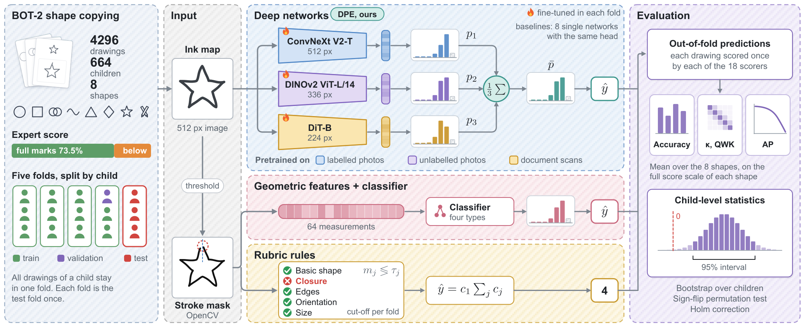
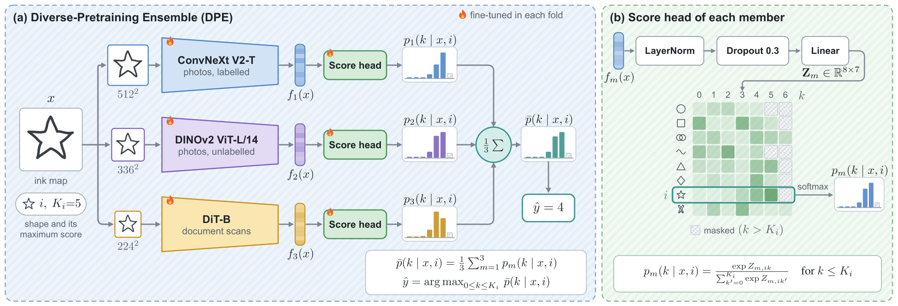

<div align="center">

<h2 style="border-bottom: 1px solid lightgray;">Rules, Features or Networks?<br/>Scoring BOT-2 Shape Copying with a Diverse-Pretraining Ensemble</h2>

<p align="center">
  <a href='LICENSE'></a>
  
  
  
</p>

</div>

<p align="center">
  
</p>

<p align="center"><b>Overview.</b> Each drawing becomes an ink map for the networks and a stroke mask for OpenCV. Deep
networks, classifiers on 64 geometric measurements and rubric rules predict the BOT-2 score. All drawings of a child
stay in one of five folds, and the scorers are compared with child-level statistics. The drawings shown are
synthetic.</p>

In the Fine Motor Integration subtest of the Bruininks-Oseretsky Test of Motor Proficiency, Second Edition (BOT-2), a
child copies eight shapes and an examiner scores each copy against rubric criteria such as closure, edges and
orientation. This repository automates that scoring and compares three ways to do it on the same child-grouped folds.
The proposed scorer, the **Diverse-Pretraining Ensemble (DPE)**, averages the score distributions of three networks
pretrained on labelled photos, unlabelled photos and document scans.


<h2 style="border-bottom: 1px solid lightgray; margin-bottom: 5px;">News</h2>

- **2026-10-05**: manuscript and figures prepared in CVPR format.
- **2026-10-04**: five-fold run finished. Every number below is an out-of-fold result of that run.


<h2 style="border-bottom: 1px solid lightgray; margin-bottom: 5px;">Method</h2>

<p align="center">
  
</p>

<p align="center"><b>DPE.</b> (a) Three encoders with different pretraining read the ink map at their own input size.
Each feeds its own score head, and DPE averages the three score distributions of the drawing's shape. The average has
no trainable weights. (b) The score head normalises the feature, maps it to 7 logits for each of the 8 shapes, keeps
the row of the drawing's shape and applies a softmax over its valid scores.</p>

For a drawing $x$ of shape $i$ with maximum score $K_i$, member $m$ gives $p_m(k \mid x, i)$ over $k = 0, \dots, K_i$, and

$$\bar{p}(k \mid x, i) = \frac{1}{3}\sum_{m=1}^{3} p_m(k \mid x, i), \qquad \hat{y} = \arg\max_{0 \le k \le K_i} \bar{p}(k \mid x, i).$$

| Paradigm | Scorers | Input |
|---|---|---|
| Deep networks | **DPE** (ConvNeXt V2-T at 512 px, DINOv2 ViT-L/14 at 336 px, DiT-B at 224 px), ResNet-50, MobileNetV3-Large, EfficientNetV2-S, ViT-B/16, CViT, and BEiT-B on photos, BEiT-B on sketches and ConvNeXt V2-T at 224 px as pretraining controls | ink map |
| Classifiers | logistic regression, SVM with an RBF kernel, random forest, gradient boosting | 64 OpenCV measurements |
| Rubric rules | one measurement and one cut-off per criterion, and the score is the number of criteria passed, or 0 if the basic shape fails | OpenCV measurements |
| Reference | most frequent training score of each shape | shape only |

All networks share one score head and one recipe: label-smoothed cross-entropy (0.05), natural sampling, AdamW with
warm-up and cosine decay, an exponential moving average of the weights and early stopping on validation accuracy. A
run whose validation predictions collapse to the most frequent score restarts at half the learning rate, at most
twice. Each rule cut-off is set on the training drawings of the fold, where Cohen's kappa with the examiner's mark for
that criterion is highest. `models.recipe()`, `features.table()` and the rule table of the notebook list every setting.


<h2 style="border-bottom: 1px solid lightgray; margin-bottom: 5px;">Results</h2>

4296 drawings of 664 children, five child-grouped folds, every drawing scored once out of fold. Acc is the mean
accuracy over the eight shapes, and kappa and QWK are computed per shape on its full score scale. AP ranks the drawings
below full marks.

| Scorer | Acc (%) | Cohen's κ | QWK | MAE | AP |
|---|:---:|:---:|:---:|:---:|:---:|
| **DPE (ours)** | **83.51** | **0.510** | 0.421 | **0.208** | **0.848** |
| ConvNeXt V2-T, 512 px | 82.77 | 0.506 | 0.427 | 0.219 | 0.825 |
| DINOv2 ViT-L/14 | 82.34 | 0.495 | 0.417 | 0.222 | 0.833 |
| ConvNeXt V2-T, 224 px | 81.99 | 0.459 | 0.393 | 0.227 | 0.816 |
| ViT-B/16 | 81.88 | 0.469 | 0.408 | 0.224 | 0.801 |
| BEiT-B, photos | 81.49 | 0.472 | **0.460** | 0.230 | 0.815 |
| BEiT-B, sketches | 81.44 | 0.442 | 0.427 | 0.230 | 0.814 |
| EfficientNetV2-S | 81.23 | 0.448 | 0.360 | 0.240 | 0.799 |
| CViT | 80.92 | 0.423 | 0.418 | 0.234 | 0.790 |
| MobileNetV3-Large | 80.15 | 0.395 | 0.319 | 0.252 | 0.784 |
| DiT-B, documents | 79.84 | 0.322 | 0.250 | 0.256 | 0.761 |
| ResNet-50 | 79.14 | 0.346 | 0.306 | 0.261 | 0.759 |
| Random forest | 77.93 | 0.181 | 0.155 | 0.277 | 0.747 |
| Gradient boosting | 77.18 | 0.224 | 0.224 | 0.285 | 0.721 |
| SVM, RBF kernel | 76.73 | 0.155 | 0.149 | 0.291 | 0.716 |
| Most frequent score | 75.72 | 0.000 | 0.000 | 0.313 | 0.437 |
| Logistic regression | 75.27 | 0.262 | 0.253 | 0.318 | 0.698 |
| OpenCV rubric rules | 51.63 | 0.104 | 0.117 | 0.859 | 0.353 |

- After Holm correction DPE was more accurate than each of the other 17 scorers (paired child-level permutation tests,
  adjusted p ≤ 0.045). Its margin over its strongest member was 0.74 points (95% interval 0.01 to 1.47).
- Without DiT-B the ensemble was equivalent to DPE within one point (83.67%) with a higher kappa (0.534). Document
  pretraining was 1.64 points less accurate than photo pretraining on the same BEiT-B architecture.
- Agreement was substantial for the circle, square and overlapped circles and fair for the wave, diamond and star.


<h2 style="border-bottom: 1px solid lightgray; margin-bottom: 5px;">Environment setup</h2>

The notebook runs on Google Colab with an A100 runtime and installs what Colab lacks:

```bash
pip install -U timm "transformers>=4.56" safetensors
```

For a local run:

```bash
pip install -r requirements.txt
```

The package versions, the GPU and the SHA-256 checksums of the code are written to `results/logs` at the start of
every run.


<h2 style="border-bottom: 1px solid lightgray; margin-bottom: 5px;">Quick start</h2>

1. Put `Shapes.zip` in a Google Drive folder, and copy this repository into a subfolder named `final` next to it.
   `DRIVE_DIR` in the setup cell is the folder that holds `Shapes.zip`.
2. Open `BOT2_5Fold_CV.ipynb` in Colab with an A100 runtime and run all cells. The training cell prints the training
   loss, training accuracy, validation accuracy and validation QWK of every epoch, and the test accuracy of every fold.
3. If the runtime stops, run all cells again. Finished units are skipped and their stored epoch logs are printed in
   their place. The runtime is released after the last cell and after any error.


<h2 style="border-bottom: 1px solid lightgray; margin-bottom: 5px;">Repository structure</h2>

```
BOT2_5Fold_CV.ipynb      the whole study in one notebook
bot2score/
  data.py                shapes and rubric criteria, archive index, ink maps, child-grouped folds
  features.py            stroke mask and the 64 OpenCV measurements
  rules.py               rubric rules with one cut-off per criterion and fold
  classical.py           logistic regression, SVM, random forest, gradient boosting, most frequent score
  models.py              networks, the shared score head and the training recipe
  training.py            fine-tuning, collapse restarts, epoch logs, embeddings
  scorers.py             names, paradigms and roles of all scorers
  metrics.py             accuracy, kappa and QWK on the full score scale
  evaluation.py          out-of-fold predictions, agreement, paired child-level statistics, t-SNE analysis
  figures.py             vector PDF figures
  verify.py              re-prediction from the saved weights and SHA-256 manifest
  utils.py               result folders, logging, Colab runtime control
assets/                  figures of this page
```

Outputs go to `results/`:

| Folder | Content |
|---|---|
| `results/data` | index of the drawings with their fold, excluded files, score and criterion tables, OpenCV features, input cache |
| `results/runs` | per scorer and fold: validation and test probabilities; for networks also test embeddings, the epoch log and the weights of the ensemble members |
| `results/predictions` | out-of-fold predicted score and probabilities of every scorer for every drawing |
| `results/metrics` | summary, agreement, accuracy per shape and per fold, metrics per shape, confusion matrices, rule cut-offs, training summary, embedding separation, weight verification |
| `results/statistics` | paired comparisons with intervals, permutation and McNemar p values, Holm-adjusted p values and verdicts |
| `results/embeddings` | out-of-fold embeddings of every network and t-SNE coordinates |
| `results/figures` | figures as vector PDF |
| `results/logs` | run log, software versions and code checksums |
| `results/manifest_sha256.csv` | SHA-256 checksum of every result file |

`verify.check_weights` rebuilds every saved ensemble member from its weight file, predicts its test fold again and
compares the probabilities with the stored ones. Linear and convolution weights are stored in bfloat16, the precision
in which they ran on the GPU, so an A100 reproduces the stored predictions.


<h2 style="border-bottom: 1px solid lightgray; margin-bottom: 5px;">Data availability</h2>

The drawings are confidential and are not distributed with this repository. No figure on this page or in the
repository shows a drawing from the archive.


<h2 style="border-bottom: 1px solid lightgray; margin-bottom: 5px;">Citation</h2>

```bibtex
@misc{ovi2026bot2dpe,
  title  = {Rules, Features or Networks? Scoring {BOT-2} Shape Copying with a Diverse-Pretraining Ensemble},
  author = {Ovi, Tanvir Hossain},
  year   = {2026},
  note   = {Manuscript in preparation}
}
```
